# Implementation for Deep Generative Models

- **Autoregressive Model (hw1)**

  - MADE

    <figure class="half">
        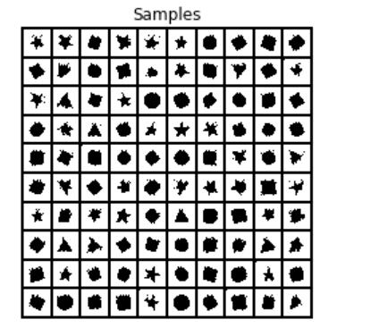
        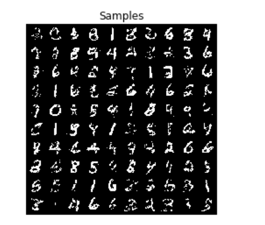
    </figure>

    

  - PixelCNN (Independent Color Channels)

    <figure class="half">
        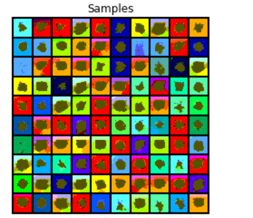
        
    </figure>

  - PixelCNN (Autoregressive Color Channels)

    <figure class="half">
        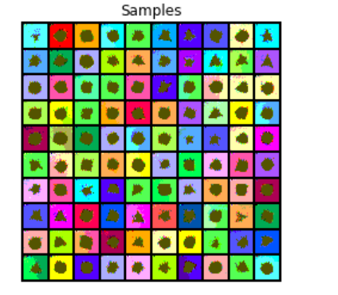
        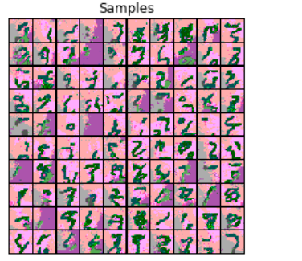
    </figure>

  - Conditional PixelCNNs

    <figure class="half">
        
        
    </figure>

- **Flow Model (hw2)**

  - Autoregressive Flow

  - RealNVP

    <figure class="half">
        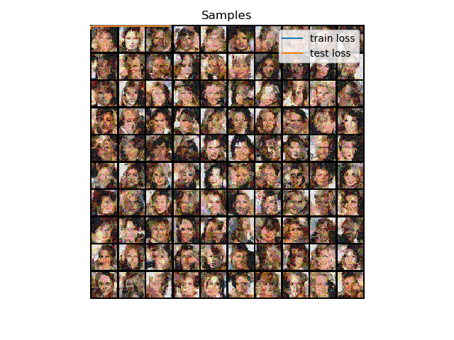
        
    </figure>

- **Latent Variable Model (hw3)**

  - VAE

  - VAE + AF Prior

    <figure class="half">
        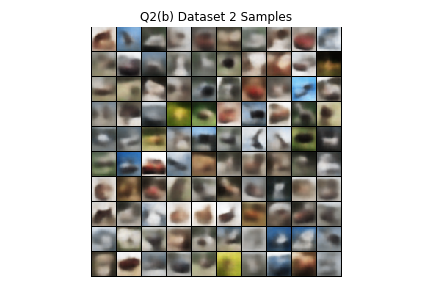
        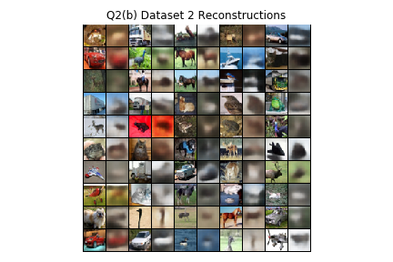
    </figure>

  - VQ-VAE + PixelCNN Prior

    <figure class="half">
        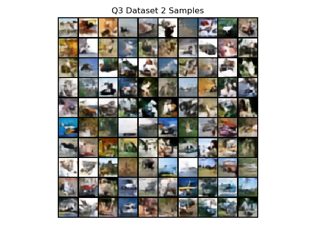
        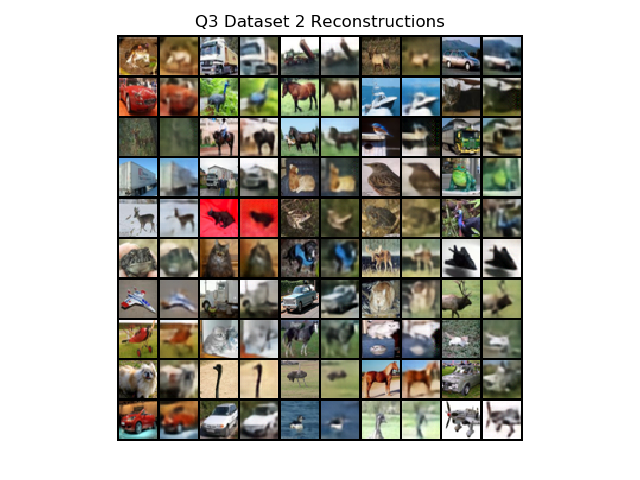
    </figure>

- **GANs (hw4)**

  - Vanilla GAN

  - WGAN-GP

    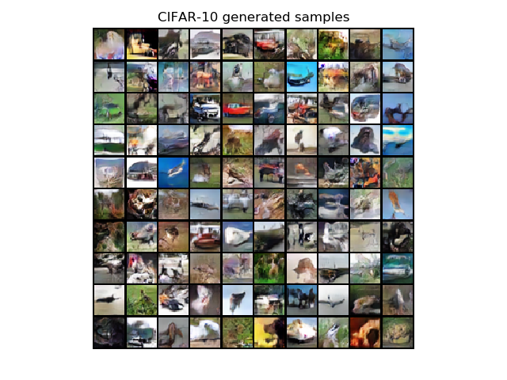

  - BiGAN

    <figure class="half">
        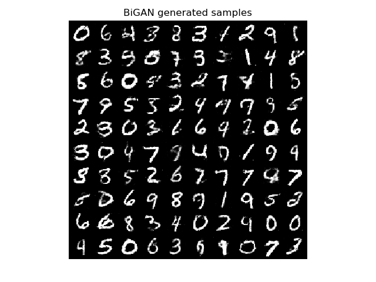
        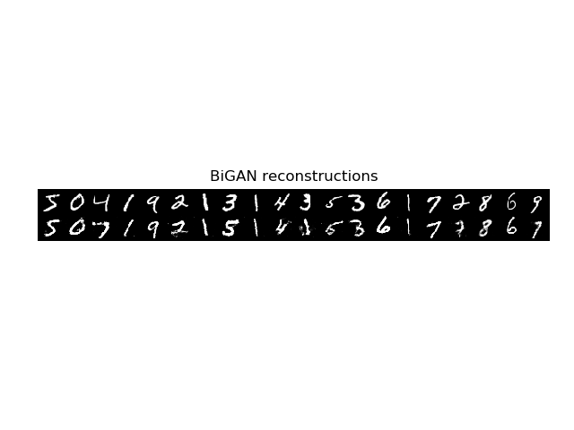
    </figure>

  - CycleGAN

    <figure class="half">
        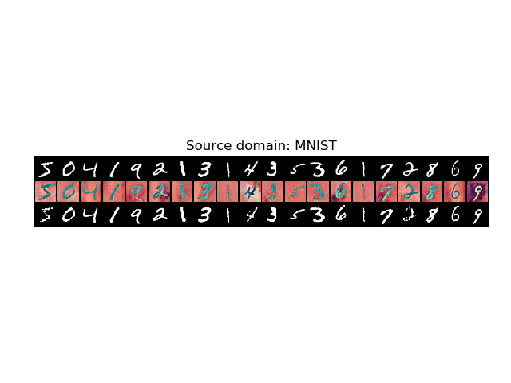
        
    </figure>

(Homework for Berkeley CS 294-158 Deep Unsupervised Learning)

